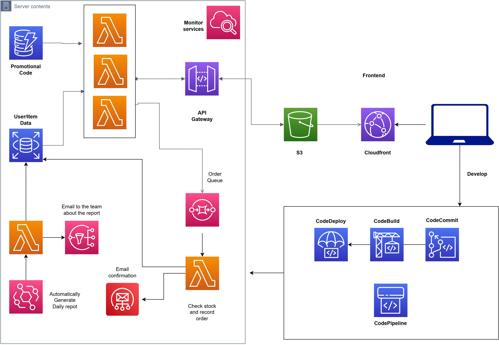

# Serverless Project

## About
This is a fully serverless project for my Serverless Cloud and Microservices class. The project is hosted using a S3 bucket with CloudFront.
The user requests are managed through AWS's API Gateway and Lambda. 
User data along with the inventory is stored using RDS (MySQL) and DynamoDB. 
Once an order is placed, SES (Simple Email Service) is triggered to alert the admin (owner) of product purchase. 
A log of daily sales is also generated using SNS (Simple Notification Service).

## Project Status

This project is currently not hosted as AWS charges for many of the features implemented.

## Built With

- 
- 
- 

## Architecture

The client sends a request to access the website. Lambda calls are made through API Gateway depending on user/ admin requests. This handles requests to display data, purchase items, or add/update items (for admins). In case there are too many requests made in a very short amount, SQS (Simple Queue Service) acts as a buffer between the producer and the consumer, making sure all messages are delivered. Other Lambda functions send receipts to the user and admin once an item is purchased. Admins are also given daily generated reports.

## Services Used
- Lambda
- API Gateway
- DynamoDB and AWS RDS
- SES and SNS
- S3 and Cloudfront
- CodePipeline, CodeBuild, CodeDeploy
- Cloudwatch
- CodeCommit
